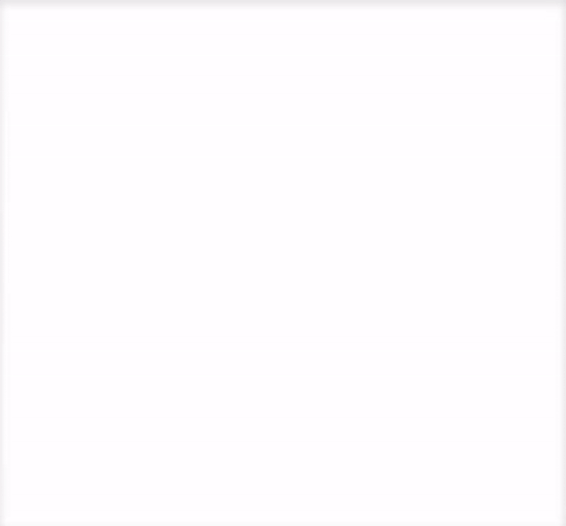

# chemlambda-py
A python implementation of [chemlabda-gui](https://github.com/chorasimilarity/chemlambda-gui/blob/gh-pages/dynamic/README.md)

[Molecule](https://raw.githubusercontent.com/4lhc/chemlambda-py/master/mol_files/lisfact_2_mod.html)
created by [mol_files/lisfact_2_mod.mol](https://raw.githubusercontent.com/4lhc/chemlambda-py/master/mol_files/lisfact_2_mod.mol)
for deteministic=True; cycle=30

### Todo
- [ ] Fix incorrect rewrite for (L a b c, A d c e) pattern
