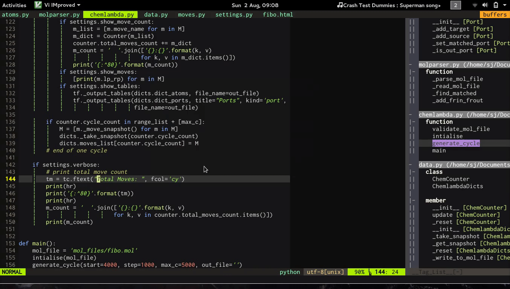

# chemlambda-py
A python implementation of [chemlabda-gui](https://github.com/chorasimilarity/chemlambda-gui/blob/gh-pages/dynamic/README.md)

The above screencast shows under-the-hood working of chemlambda-py. It's still
under development. Core features are already implemented. Chemlambda-py is 
intended to be used as a python package around which various flavours of chemlambda 
can be build.

Molecule created by [mol_files/lisfact_2_mod.mol](https://raw.githubusercontent.com/4lhc/chemlambda-py/master/mol_files/lisfact_2_mod.html)
for deteministic=True; cycle=30

### Todo
- [ ] Save cycles to file
- [ ] Split cycles into chunks
- [x] Define COMB moves
- [x] Deterministic moves
- [ ] Clean-up!
- [ ] Write a formal mol file validator
- [ ] HTML output
- [x] sorted table stdout
